# 在线考试系统

面向学校、培训机构与课程团队的在线考试平台，覆盖题库管理、试卷组装、考试发布、学生作答、阅卷治理、成绩分析、通知协同与基础风控。

## 项目定位

本仓库交付的不是演示型原型，而是一套可启动、可验证、可讲解、可继续维护的考试系统成果。当前版本重点解决以下场景：

- 教师组织线上考试：建题、组卷、发布、分配考生、查看分析
- 学生参加考试：待考、签到、进入考试、自动保存、交卷、查成绩、答卷回看
- 管理与治理：组织用户维护、权限边界、监考事件、登录风险、通知模板、质量报告

## 核心能力总览

| 能力域 | 当前交付能力 | 验证方式 |
| --- | --- | --- |
| 账号与权限 | 登录、注册、找回密码、验证码 mock 通道、组织范围隔离、按钮级权限基础版 | 后端集成测试、Playwright `auth-account-flow`、权限路由回归 |
| 题库与题型 | 单选、多选、判断、简答、填空、论述、材料题；独立题目编辑页；知识点自动组题 | 后端题型增强测试、Playwright `question-type-enhancement` |
| 试卷与考试 | 手工/随机/策略组卷、补考/缓考/重考、批次、签到、准考证、考场与座位 | 后端考试计划测试、Playwright `teacher-paper-plan`、`exam-plan-mode` |
| 学生端闭环 | 待考列表、设备检测、自动保存、手动保存、待复查、交卷、成绩查询、答卷回看、错题本 | Playwright `student-exam`、`candidate-review-center`、`student-score-flow` |
| 阅卷与成绩治理 | 客观题自动判分、主观题人工评分、复核、重判、申诉、成绩发布 | 后端治理测试、Playwright `grading-flow`、`grading-governance` |
| 分析与报告 | 排名、分数段、知识点分析、题目得分率、质量报告、导出 | Playwright `quality-report`、`export-flow` |
| 通知与协同 | 公告、消息中心、通知模板、开考前提醒、Mock 短信投递日志 | 后端通知流测试、Playwright `notification-flow` |
| 安全与运维 | 登录风险记录、失败锁定、IP 限流、健康检查、初始化回归、备份恢复脚本 | 后端安全测试、`verify-mysql-init.ps1`、runbook 实跑 |

## 系统角色与典型流程

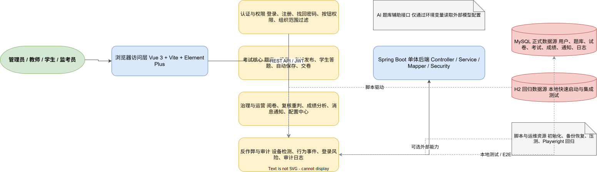

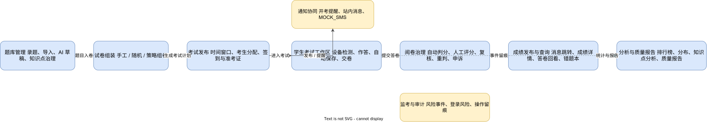

## 系统截图预览

| 页面 | 预览 |
| --- | --- |
| 登录页 | 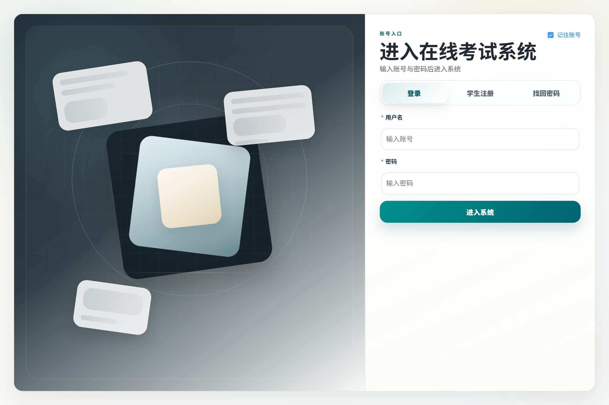 |
| 首页看板 | 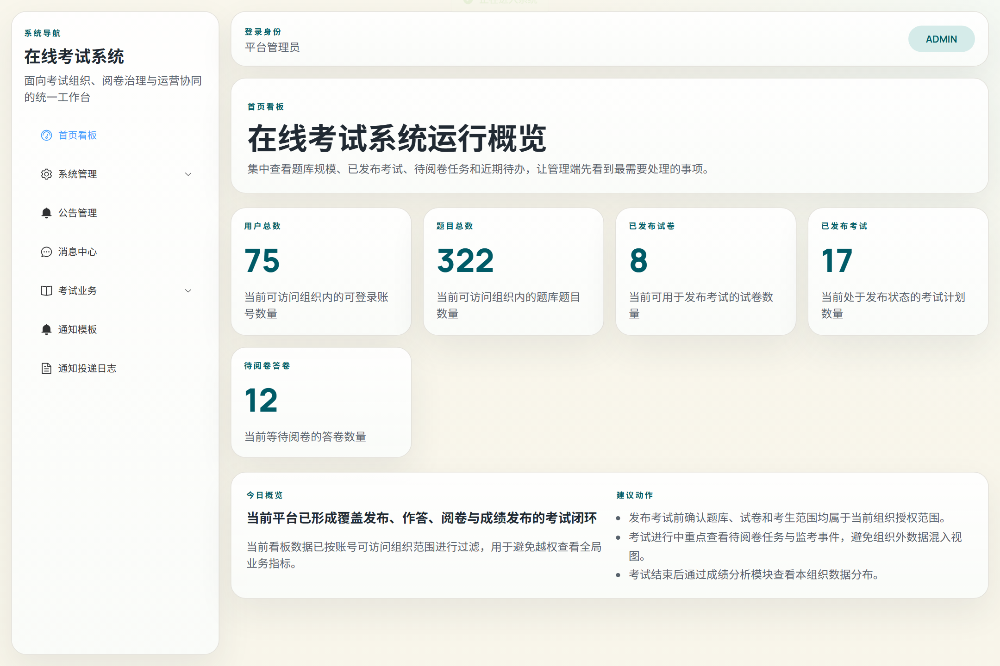 |
| 题库管理 | 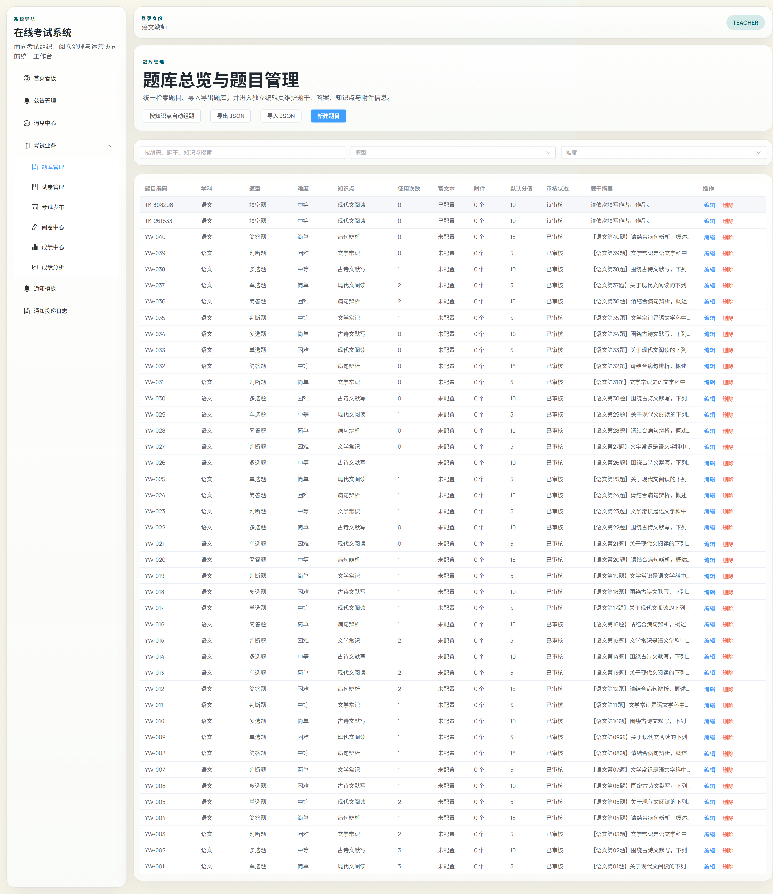 |
| 组卷页 | 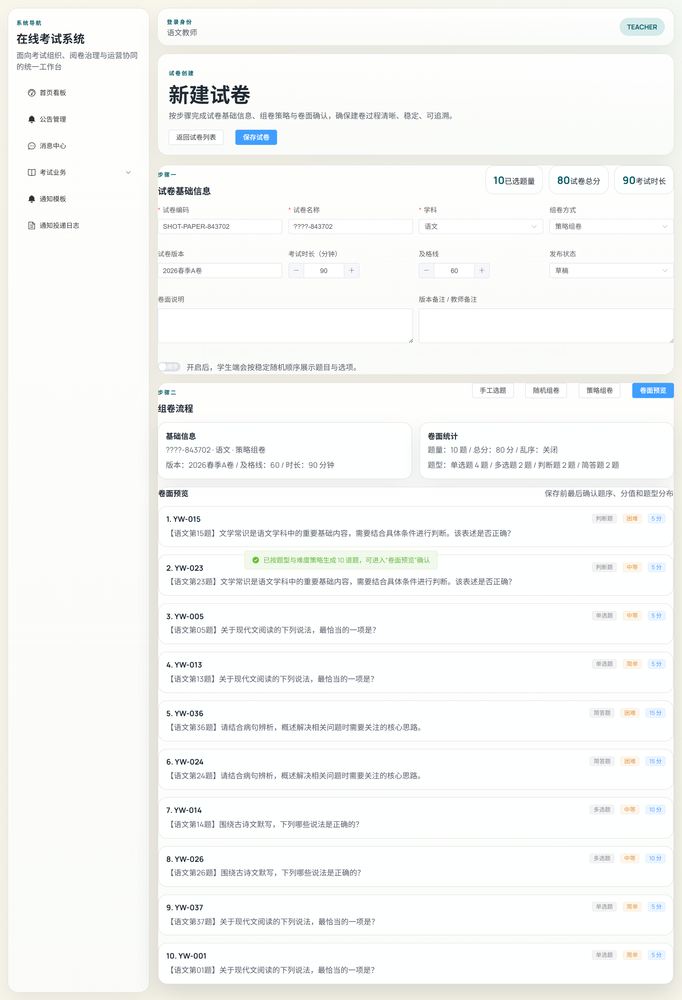 |
| 考试发布 | 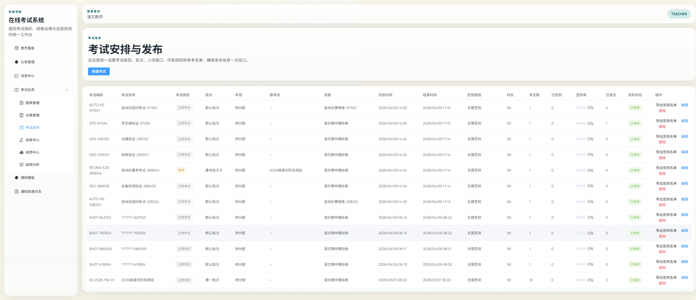 |
| 学生考试工作区 | 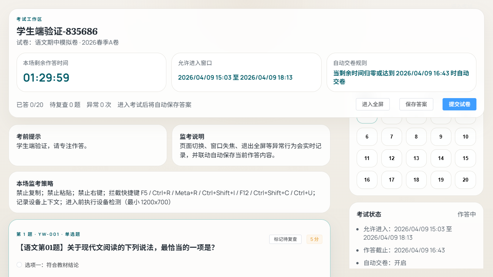 |
| 阅卷中心 | 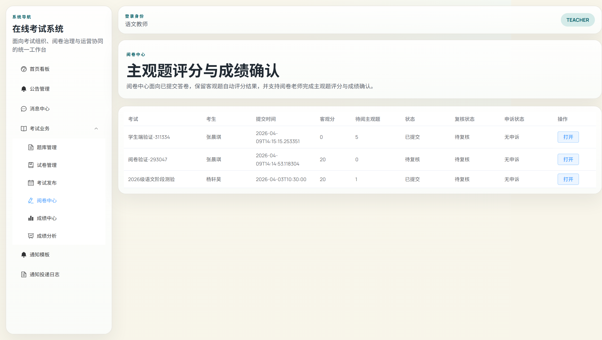 |
| 成绩分析 | 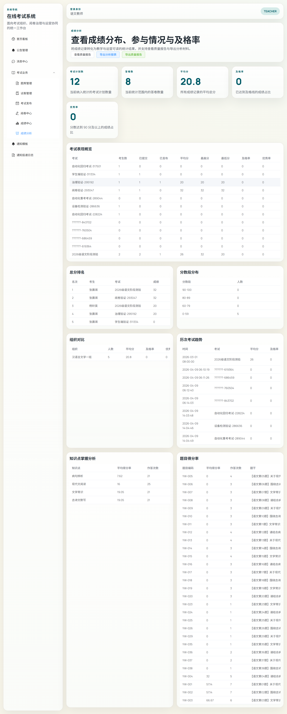 |
| 角色权限 | 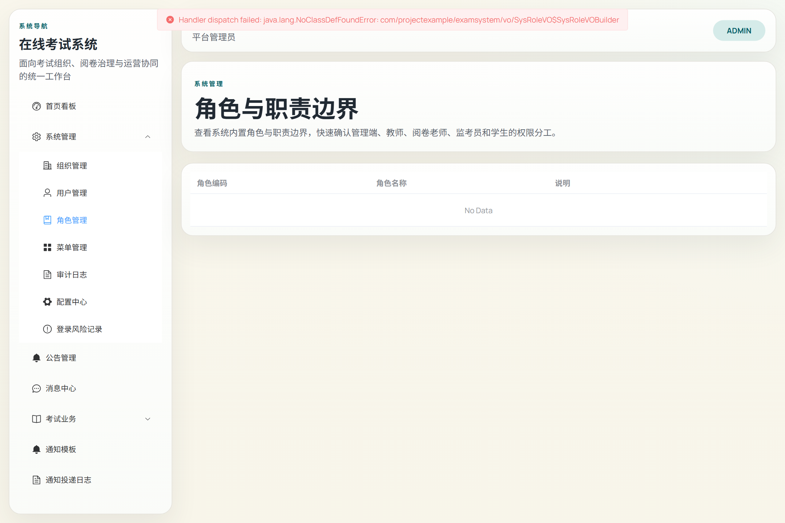 |
| 系统配置 | 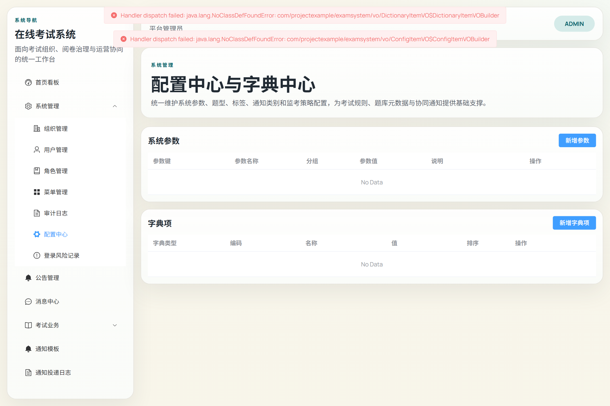 |

## 技术架构概览

| 层次 | 技术方案 |
| --- | --- |
| 前端 | Vue 3、TypeScript、Vite、Element Plus、Pinia、Vue Router |
| 后端 | Spring Boot 3、Spring Security、MyBatis-Plus、JWT、Knife4j/OpenAPI |
| 数据库 | MySQL（正式口径）、H2（本地快速启动与测试） |
| 自动化 | Maven 测试、Playwright E2E、MySQL 初始化回归脚本 |
| 运维脚本 | 初始化、备份、恢复、压测、截图与图示生成 |

## 快速启动

### 1. 环境准备

- Java 17+
- Maven 3.9+
- Node.js 20+
- MySQL 8.x（如需走正式数据口径）

### 2. 启动后端

默认 H2 快速模式：

```powershell
cd backend
mvn -q -DskipTests package
java -jar target/exam-system-backend-0.1.0-SNAPSHOT.jar
```

MySQL 模式：

```powershell
$env:SPRING_PROFILES_ACTIVE='mysql'
$env:MYSQL_HOST='127.0.0.1'
$env:MYSQL_PORT='3306'
$env:MYSQL_DATABASE='exam_system'
$env:MYSQL_USERNAME='root'
$env:MYSQL_PASSWORD='123456'
cd backend
mvn -q -DskipTests package
java -jar target/exam-system-backend-0.1.0-SNAPSHOT.jar
```

### 3. 启动前端

```powershell
cd frontend
npm.cmd install
npm.cmd run dev
```

### 4. 默认地址

- 前端：`http://127.0.0.1:5173`
- 后端：`http://127.0.0.1:8083`
- 接口文档：`http://127.0.0.1:8083/swagger-ui.html`

## 默认测试账号

| 角色 | 账号 | 密码 |
| --- | --- | --- |
| 平台管理员 | `900001` | `123456` |
| 教务管理员 | `900002` | `123456` |
| 教师 | `800001` | `123456` |
| 阅卷老师 | `810001` | `123456` |
| 监考员 | `820001` | `123456` |
| 学生 | `20260001` | `123456` |

## 验证结果摘要

本轮已完成的真实验证：

- 后端：`mvn -q test`
- 后端打包：`mvn -q -DskipTests package`
- 前端：`npm.cmd run build`
- 浏览器回归：`npx.cmd playwright test`，17 条用例全部通过
- 数据库：`powershell -NoProfile -ExecutionPolicy Bypass -File scripts/verify-mysql-init.ps1`
- 本地 MySQL 连通性校验：`sys_user`、`biz_exam_plan`、`sys_notification_template` 等关键表可查询
- 图示导出：通过 draw.io CLI 生成 `.drawio + png + svg`

## 已知限制

- 邮件、短信、企业微信、钉钉仍以统一适配层与 Mock 通道为主，未接入真实外部网关
- 监考仍是基础治理能力，暂不包含摄像头、人脸识别、活体检测等高级能力
- 统计分析已覆盖考试与知识点层级，班级/年级/部门趋势分析仍可继续深化
- 前端生产构建仍有大体积 chunk 警告，当前不影响功能可用性

## 文档导航

- [产品级用户使用说明书](docs/ops/产品级用户使用说明书.md)
- [开发记录与系统说明](Documentation.md)
- [产品需求说明书](PRD.md)
- [验收标准](ACCEPTANCE.md)
- [设计与实现决策](DECISIONS.md)
- [模块说明](docs/modules/exam-core.md)
- [运行与故障处理](docs/runbooks/README.md)
- [部署说明](docs/deployment/README.md)

## 仓库远端

当前正式远端仓库：

- [https://github.com/qinghe-zy/exam_system.git](https://github.com/qinghe-zy/exam_system.git)
