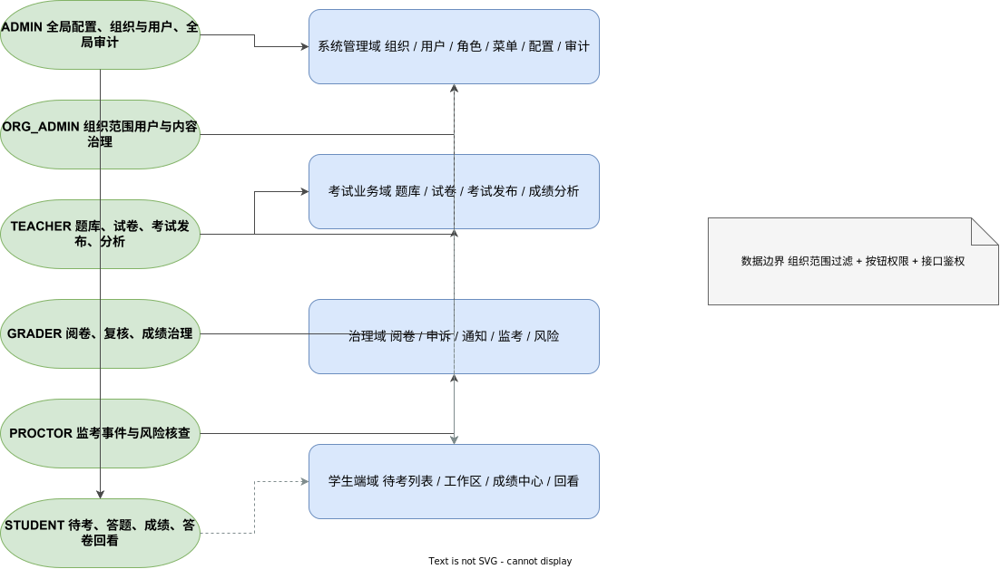

# 产品级用户使用说明书

## 1. 文档目的与适用对象

本文档用于作为在线考试系统的正式交付说明书，适用于以下对象：

- 甲方验收人员
- 教务老师、命题老师、阅卷老师、监考老师
- 运维与实施人员
- 后续接手开发人员

本文档覆盖产品概述、角色权限、安装部署、数据库初始化、启动停止、日常使用、运维巡检、备份恢复、故障排查和已知限制。

## 2. 产品概述

在线考试系统用于支撑学校或培训机构的日常考试组织与过程治理，当前已形成一套从题库管理到成绩发布的完整闭环：

1. 教师录入题目或导入题库
2. 教师通过手工、随机或策略方式组卷
3. 教师发布考试并分配考生
4. 学生签到、进入考试、自动保存、提交答卷
5. 阅卷老师评分，管理端复核、重判与处理申诉
6. 系统发布成绩并生成分析报表与质量报告

## 3. 角色与权限说明

| 角色 | 主要职责 | 访问范围 |
| --- | --- | --- |
| 平台管理员 | 全局配置、组织与用户、审计、全局治理 | 全部组织、全部系统模块 |
| 机构管理员 | 机构范围内用户、考试与运营管理 | 当前组织及其下级组织 |
| 教师 | 题库、试卷、考试发布、成绩分析 | 当前组织范围内考试业务 |
| 阅卷老师 | 主观题评分、复核协作 | 阅卷中心、成绩治理相关模块 |
| 监考员 | 监考事件、异常行为查看 | 监考事件与风险留痕 |
| 学生 | 待考、答题、成绩、答卷回看、错题本 | 仅访问本人数据 |

角色与系统模块关系图如下：



## 4. 功能模块说明

### 4.1 账号与权限

- 支持登录、学生注册、找回密码
- 支持邮箱 / 短信验证码 Mock 通道
- 支持组织范围隔离与按钮级权限基础控制
- 记录登录风险、失败锁定与 IP 限流

### 4.2 题库管理

- 支持单选、多选、判断、简答、填空、论述、材料题
- 支持题干、富文本 HTML、附件 JSON、答案、解析、知识点、章节、标签
- 支持 JSON 导入导出
- 支持按知识点自动组题
- 支持 AI 题目草稿与 AI 优化题干

### 4.3 试卷与考试发布

- 支持手工、随机、策略组卷
- 支持补考 / 缓考 / 重考、批次、签到规则、准考证、考场与座位
- 支持考试密码、迟到限制、提前交卷限制、自动交卷
- 支持开考前提醒与通知模板

### 4.4 学生考试工作区

- 支持待考列表、入场说明、设备检测、自动保存、手动保存、待复查
- 支持交卷确认、成绩查询、答卷回看、错题本
- 支持复制粘贴限制、右键限制和快捷键限制

### 4.5 阅卷与成绩治理

- 客观题自动判分，主观题人工评分
- 支持复核、重判、申诉处理
- 支持成绩发布、成绩导出、质量报告和分析导出

### 4.6 系统治理与运维

- 支持公告、消息中心、通知模板、投递日志
- 支持登录风险记录、监考事件、审计日志
- 支持健康检查、MySQL 初始化回归、备份恢复和压测脚本

## 5. 典型业务流程

### 5.1 核心业务闭环


### 5.2 部署与启动流程


## 6. 运行环境要求

| 组件 | 要求 |
| --- | --- |
| 操作系统 | Windows 10/11 或等价开发/验收环境 |
| Java | 17 及以上 |
| Maven | 3.9 及以上 |
| Node.js | 20 及以上 |
| npm | 10 及以上 |
| MySQL | 8.x |
| 浏览器 | Edge / Chrome 最新版 |

## 7. 安装部署说明

### 7.1 代码准备

```powershell
git clone https://github.com/qinghe-zy/exam_system.git
cd exam-system
```

### 7.2 前端依赖安装

```powershell
cd frontend
npm.cmd install
```

### 7.3 后端构建

```powershell
cd backend
mvn -q -DskipTests package
```

### 7.4 启动方式

#### 方案 A：H2 快速模式

```powershell
cd backend
java -jar target/exam-system-backend-0.1.0-SNAPSHOT.jar
```

#### 方案 B：MySQL 模式

```powershell
$env:SPRING_PROFILES_ACTIVE='mysql'
$env:MYSQL_HOST='127.0.0.1'
$env:MYSQL_PORT='3306'
$env:MYSQL_DATABASE='exam_system'
$env:MYSQL_USERNAME='root'
$env:MYSQL_PASSWORD='123456'
cd backend
java -jar target/exam-system-backend-0.1.0-SNAPSHOT.jar
```

#### 前端启动

```powershell
cd frontend
npm.cmd run dev
```

## 8. 数据库初始化说明

### 8.1 初始化脚本

- 全量脚本：`sql/mysql/init.sql`
- 后端运行时脚本：`backend/src/main/resources/schema.sql`
- 基线脚本：`sql/schema-baseline.sql`

### 8.2 初始化回归

```powershell
powershell -NoProfile -ExecutionPolicy Bypass -File scripts/verify-mysql-init.ps1
```

### 8.3 关键校验项

- 用户、角色、菜单、题库、试卷、考试计划存在
- `sys_notification_template`、`biz_notification_delivery_log`、`biz_login_risk_log` 存在
- 签到、批次、考场、座位、组织隔离字段存在

## 9. 环境变量配置说明

正式仓库内仅保留示例值，不提交真实密钥或生产账号。

### 9.1 MySQL

```env
SPRING_PROFILES_ACTIVE=mysql
MYSQL_HOST=127.0.0.1
MYSQL_PORT=3306
MYSQL_DATABASE=exam_system
MYSQL_USERNAME=root
MYSQL_PASSWORD=123456
```

### 9.2 AI 接口预留

```env
AI_API_BASE_URL=
AI_API_KEY=
AI_MODEL=
```

## 10. 启动与停止方式

### 10.1 启动

- 后端启动后访问 `http://127.0.0.1:8083/swagger-ui.html`
- 前端启动后访问 `http://127.0.0.1:5173`

### 10.2 停止

- 关闭前端开发终端
- 关闭后端运行终端
- 如为后台进程，结束对应 `java` 或 `node` 进程

## 11. 默认账号与初始化数据说明

| 角色 | 账号 | 密码 |
| --- | --- | --- |
| 平台管理员 | `900001` | `123456` |
| 教务管理员 | `900002` | `123456` |
| 教师 | `800001` | `123456` |
| 阅卷老师 | `810001` | `123456` |
| 监考员 | `820001` | `123456` |
| 学生 | `20260001` | `123456` |

初始化数据包含：

- 组织树、角色、菜单、字典和系统参数
- 题库、试卷、考试计划、成绩记录、通知模板
- 登录风险日志与监考事件示例数据

## 12. 页面使用说明

### 12.1 管理端首页

- 查看题库总量、试卷数量、已发布考试、待阅卷任务
- 阅读建议动作，快速判断当前待处理事项

### 12.2 题库管理

- 使用筛选区按题目编码、题型、难度、知识点检索
- 点击“新建题目”进入独立编辑页
- 通过“按知识点自动组题”快速生成候选题组

### 12.3 试卷管理与组卷

- 列表页查看试卷总览
- 进入独立建卷页完成基础信息、手工选题、随机组卷或策略组卷
- 在卷面预览区确认题序与分值后保存

### 12.4 考试发布

- 配置考试时间窗口、考试密码、考生名单、考试类型、批次
- 配置签到规则、考场与座位
- 查看签到人数、签到率和准考证信息

### 12.5 学生端

- 在“我的考试”查看待考列表
- 如开启签到，先完成签到后进入考试
- 进入工作区后按提示作答、保存、交卷
- 在“我的成绩”和“答卷回看”查看已发布成绩和错题

### 12.6 阅卷中心

- 阅卷老师进入待处理答卷，完成评分
- 管理端执行复核通过、退回重判或处理申诉

### 12.7 通知与风险

- 在“消息中心”查看成绩发布提醒、申诉结果、安全告警
- 在“通知模板”“通知投递日志”查看模板和 Mock 通道留痕
- 在“登录风险记录”“监考事件”查看风险与异常行为

## 13. 常见操作 SOP

### 13.1 教师发布一场考试

1. 在题库中维护题目
2. 在试卷管理中创建并保存试卷
3. 在考试发布中选择试卷、设置时间、指定考生
4. 发布考试并确认通知生成

### 13.2 学生参加考试

1. 登录系统进入“我的考试”
2. 查看准考证 / 通知单
3. 如需签到，先签到
4. 输入考试口令后进入工作区
5. 保存、交卷、查看成绩

### 13.3 管理员处理成绩申诉

1. 进入成绩中心
2. 查看申诉记录
3. 选择驳回或转入重判
4. 发布最终结果并通知学生

## 14. 运维与巡检建议

- 每次部署前执行一次 `verify-mysql-init.ps1`
- 发布前至少执行一次 `mvn -q test` 与 `npx.cmd playwright test`
- 定期检查 `biz_notification_delivery_log`、`biz_login_risk_log`、`biz_anti_cheat_event`
- 通过健康检查接口确认应用和数据库状态

## 15. 备份恢复说明

```powershell
powershell -NoProfile -ExecutionPolicy Bypass -File scripts/backup-mysql.ps1
powershell -NoProfile -ExecutionPolicy Bypass -File scripts/restore-mysql.ps1 -BackupFile <备份文件> -Database exam_system_restore_verify -DropExisting
```

详细步骤见：

- [MySQL 备份与恢复 Runbook](../runbooks/mysql-backup-restore.md)

## 16. 故障排查指南

### 16.1 登录失败

- 检查账号密码是否正确
- 查看 `登录风险记录` 页是否触发临时锁定
- 如账号被锁定，可执行找回密码重置

### 16.2 页面无数据

- 检查当前账号角色和组织范围
- 调用 `GET /api/system/runtime/health` 检查数据库连接
- 确认浏览器中 JWT 未失效

### 16.3 无法进入考试

- 检查考试是否已发布且在允许进入窗口内
- 检查是否需要签到
- 检查考试口令、设备检测和考试规则限制

### 16.4 打包或运行失败

- 检查 Java / Maven / Node 版本
- 检查后端 `target/` 是否被运行中的进程占用
- 检查 `8083` 和 `5173` 端口是否冲突

## 17. 安全边界与注意事项

- 不在仓库中提交真实数据库密码、Token、私钥、AI Key
- AI 接口仅通过环境变量读取
- 当前通知外发以 Mock 通道为主，外部网关需后续单独接入
- 考试期间已对高风险更新/删除操作增加保护，但不阻断教师准备新题目和新试卷

## 18. 验收建议

建议验收按以下顺序进行：

1. 启动系统并检查健康接口
2. 管理员登录查看组织、用户、配置、风险记录
3. 教师完成录题、组卷、发布考试
4. 学生进入考试、保存、交卷、查分
5. 阅卷老师评分，管理端复核和处理申诉
6. 查看通知模板、投递日志、监考事件与分析报表

## 19. 已知限制与后续扩展建议

### 19.1 当前限制

- 外部短信 / 邮件 / 企业微信 / 钉钉未接入
- 高级防作弊能力（摄像头、人脸、活体检测）未接入
- 更深层班级 / 年级 / 部门趋势分析仍可继续深化

### 19.2 后续扩展建议

- 接入真实通知网关与失败补偿机制
- 深化监考策略与风险评分模型
- 增强质量报告、组织对比和趋势分析
- 补充更细粒度的权限配置界面

## 20. 文档附录

### 20.1 图示索引

- [系统总体架构图](../assets/diagrams/system-architecture.svg)
- [核心业务闭环流程图](../assets/diagrams/core-business-flow.svg)
- [角色权限关系图](../assets/diagrams/role-permission-map.svg)
- [部署拓扑图](../assets/diagrams/deployment-topology.svg)
- [初始化与启动流程图](../assets/diagrams/init-startup-flow.svg)

### 20.2 重要入口

- 根入口：`README.md`
- 运行说明：`docs/runbooks/README.md`
- 模块说明：`docs/modules/exam-core.md`
- 开发记录：`Documentation.md`

### 20.3 目录说明

| 路径 | 说明 |
| --- | --- |
| `backend/` | 后端源码、测试与运行配置 |
| `frontend/` | 前端源码、自动化测试与截图脚本 |
| `sql/` | MySQL 初始化与基线脚本 |
| `scripts/` | 运维、验证与 draw.io 图示生成脚本 |
| `docs/assets/` | 截图与图示资源 |
